# Bài 2: Database Partitioning

Table chưa partitioning

## Horizontal Partition

 Khái niệm: Phân vùng ngang (Horizontal Partitioning hay Sharding) là việc chia một bảng lớn thành nhiều bảng nhỏ hơn theo các hàng (rows). Mỗi phân vùng sẽ chứa cùng chung sơ đồ các cột (schema) nhưng mang các bản ghi (records) khác nhau, thường dựa trên một khóa phân vùng (partition key) như ID, năm, hay khu vực.
 - **Lợi ích:** 
   - Tối ưu hóa hiệu suất truy vấn (scan dữ liệu nhanh hơn trên bảng nhỏ).
   - Dễ dàng mở rộng ngang (Scale-out) bằng cách đặt các phân vùng lên nhiều máy chủ cơ sở dữ liệu (Database nodes/servers) khác nhau để cân bằng tải.
 - **Dùng khi:** Các bảng chứa lượng dữ liệu khổng lồ (hàng tỷ bản ghi) nhưng các câu truy vấn thường tập trung theo một tiêu chí (ví dụ: truy vấn log theo tháng, lấy người dùng theo quốc gia).

 Table đã partition theo horizontal theo khu vực (chia ra 3 khu vực VietNam, USA, Canada)
 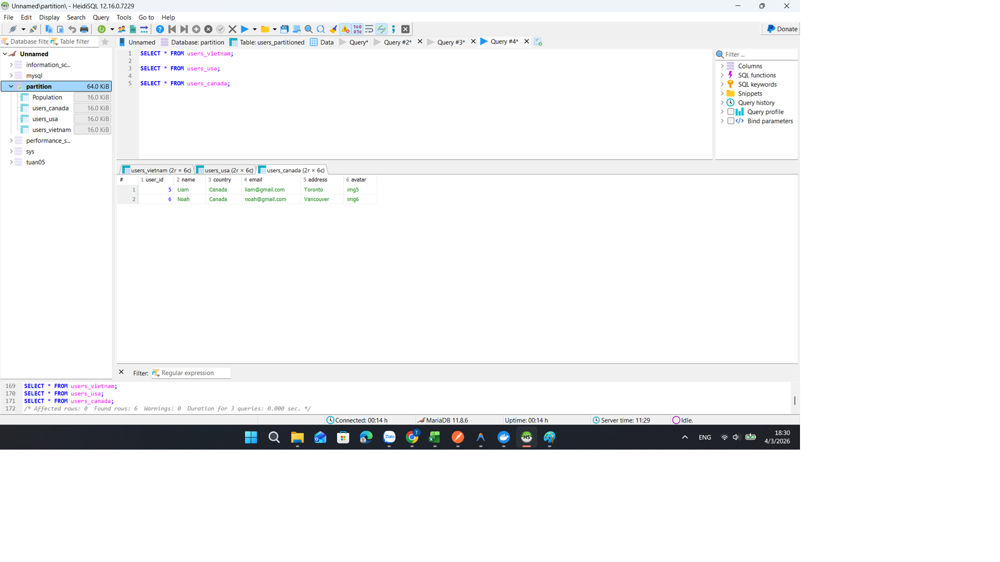 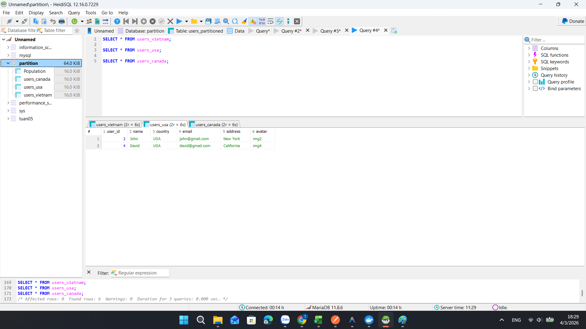 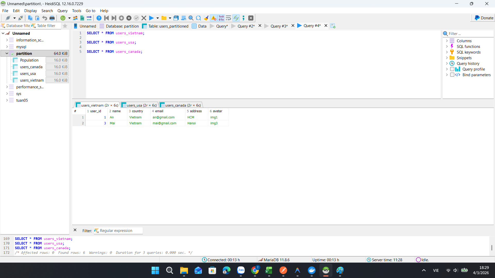

## Vertical Partition

 Khái niệm: Phân vùng dọc (Vertical Partitioning) là việc chia một bảng lớn thay vì theo hàng thì chia theo các cột (columns). Các cột được gom thành các tập hợp tách ra thành bảng mới, và thường giữ lại cùng một Primary Key để liên kết (ánh xạ 1-1).
 - **Lợi ích:** 
   - Giảm lượng I/O khi đọc (row width hẹp hơn) do các truy vấn không phải load các cột chứa lượng dữ liệu phụ trợ khổng lồ vào RAM.
   - Cho phép tách rời các cụm dữ liệu nhạy cảm hoặc các file nặng.
 - **Dùng khi:** Khi một bảng có quá nhiều cột, trong đó có một vài cột thường xuyên bị truy vấn (ví dụ ID, Password, Username), và các cột khác chứa dữ liệu tốn kém không gian như Text mô tả (BIO), hình ảnh (BLOB) hiếm khi bị lấy ra cùng.

 Table đã partition theo vertical theo thông tin cá nhân (users_main) và thông tin tài khoản (users_detail)
 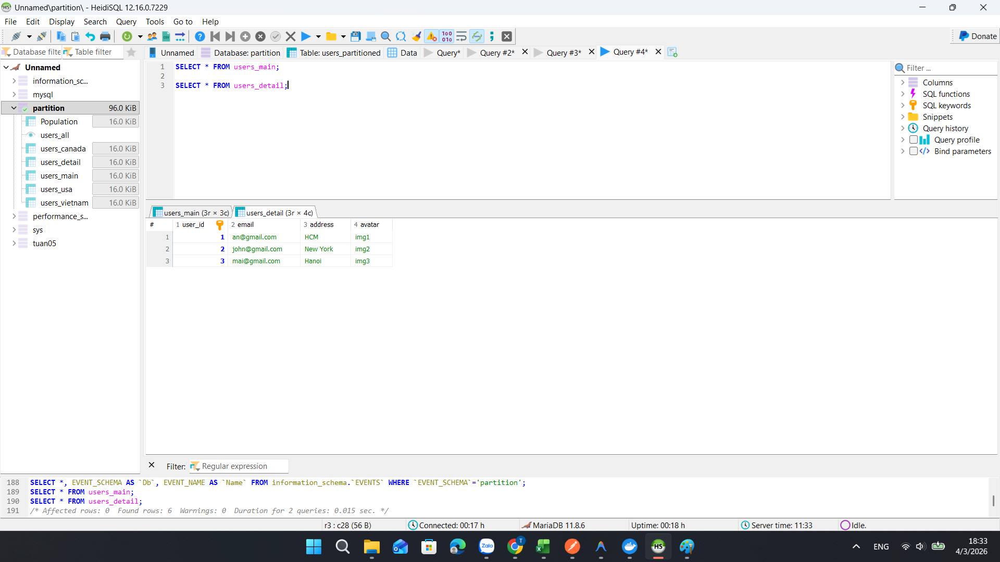 

## Functional Partition

 Khái niệm: Phân vùng đa chức năng (Functional Partitioning) là phương pháp tách biệt cơ sở dữ liệu hoàn toàn không dựa vào kỹ thuật chia bảng, mà dựa trên giới hạn nghiệp vụ (business domains) của hệ thống. Các bảng phục vụ cho một bài toán/module riêng biệt sẽ nằm gọn thành một Database riêng biệt.
 - **Lợi ích:** 
   - Tạo ra sự cô lập cao (High Isolation). Lỗi hoặc quá tải trên cơ sở dữ liệu của một service sẽ không làm sập các service khác trong toàn hệ thống.
   - Thích ứng hoàn hảo với các kiến trúc hướng dịch vụ lớn.
 - **Dùng khi:** Được ứng dụng là mô hình cốt lõi khi thiết kế các kiến trúc Microservices / Service-Based Architecture. Dùng khi hệ thống cần chia tách rõ ranh giới các cụm chức năng (ví dụ: Database chuyên cho Đặt Hàng, Database cho Thanh Toán).

 Table đã partition theo functional theo chức năng (chia ra 3 database: users, user_profile, user_auth)
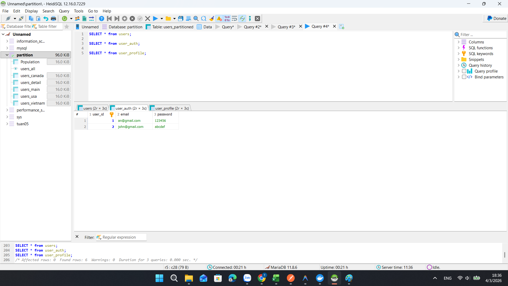 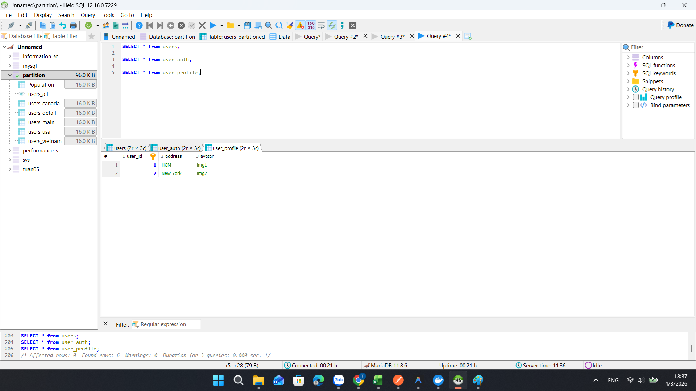 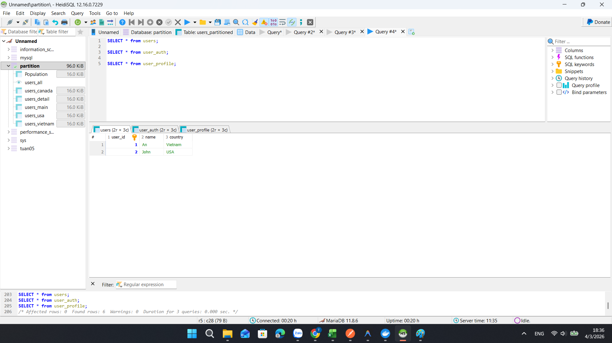

# Bài 3: Service-Based Architecture

## Cách  làm trong bài 3 này:

Trong bài thực hành này,  đã thiết kế và triển khai một hệ thống theo kiến trúc Service-base sử dụng Spring Boot cho backend và một giao diện web HTML cơ bản cho frontend. Kiến trúc bao gồm các service cụ thể:

1. **Khởi tạo cơ sở dữ liệu:**
    đã thiết lập file `docker-compose.yaml` để chạy một container **MariaDB**. Database này sẽ cung cấp nơi lưu trữ dữ liệu chung hoặc riêng biệt cho các microservice.

2. **Xây dựng các Backend Services (Spring Boot):**
   - **Order Service (`orderService` - port `8081`)**: Quản lý các đơn hàng.
   - **Payment Service (`paymentService` - port `8082`)**: Xử lý các tác vụ thanh toán.
   - **Shipping Service (`shippingService` - port `8083`)**: Quản lý giao dịch vận chuyển.
   
   Mỗi service hoạt động độc lập và phơi bày (expose) các API RESTful của riêng nó.

3. **Thiết lập API Gateway (`apiGateway` - port `8080`)**:
   - Sử dụng **Spring Cloud Gateway (WebMVC)** để làm cổng giao tiếp duy nhất giữa Frontend và hệ thống Backend.
   - Thay vì frontend gọi trực tiếp port `8081`, `8082`, hay `8083`,  đã config các routes (trong file `application.yaml`) để API Gateway định tuyến request:
     - `/orders/**` → Route tới `http://localhost:8081`
     - `/payments/**` → Route tới `http://localhost:8082`
     - `/shippings/**` → Route tới `http://localhost:8083`
   - Cấu hình giải quyết lỗi **CORS Policy**, cho phép frontend được quyền gọi API thông qua Gateway.

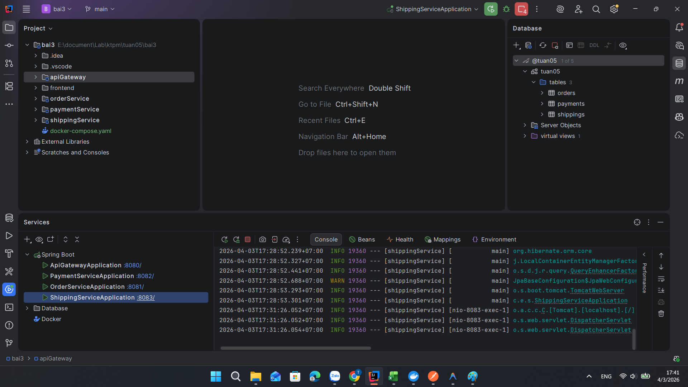

4. **Tích hợp Frontend (`frontend/index.html`)**:
   -  tạo một giao diện Web đơn giản (Single Page) hoàn toàn gọi qua địa chỉ `http://localhost:8080` (API Gateway) để thao tác lấy dữ liệu và hiển thị lên màn hình.
   - Việc gọi thông qua Gateway giúp bảo mật đường link gốc của các service backend và quy hoạch dễ dàng.

## Kết quả đạt được:
- Ứng dụng chạy thành công trọn vẹn mô hình Service-base thay vì Monolithic.
- Giao diện có thể gọi và hiển thị được dữ liệu từ các service (order, payment, shipping) một cách hoàn hảo thông qua cổng API Gateway duy nhất quản lý luồng dữ liệu.
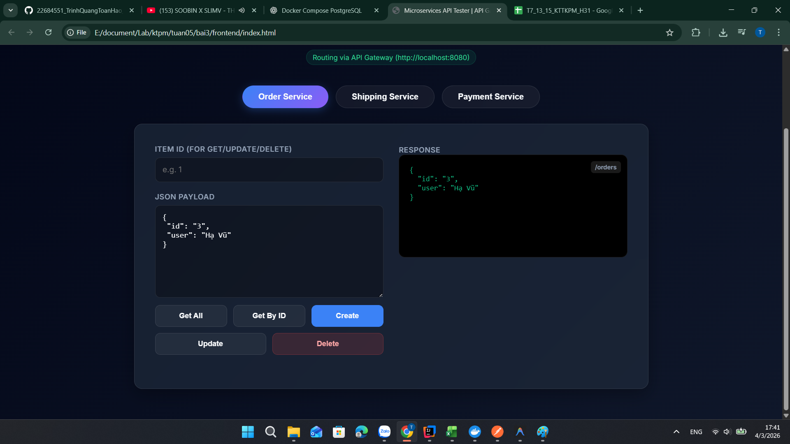 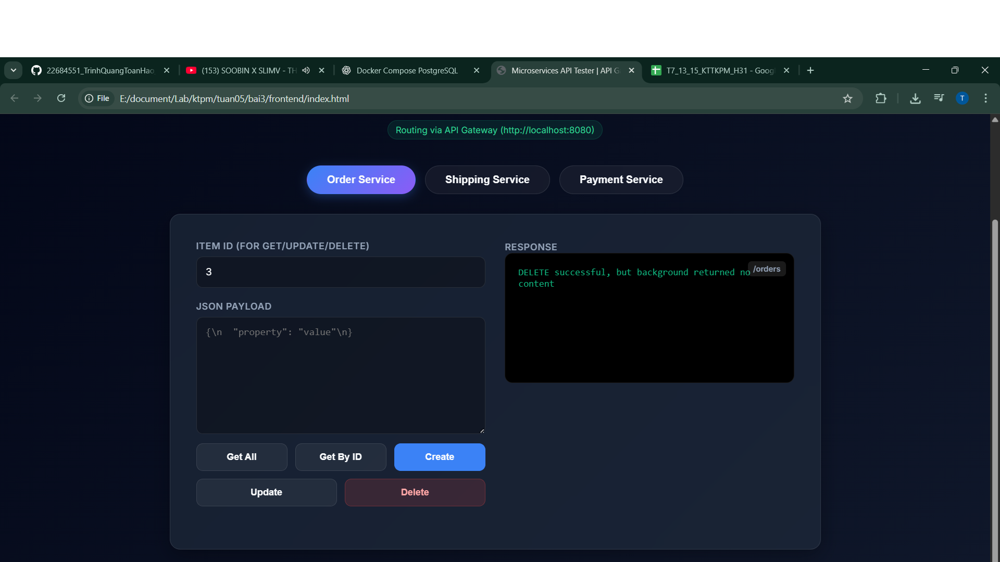 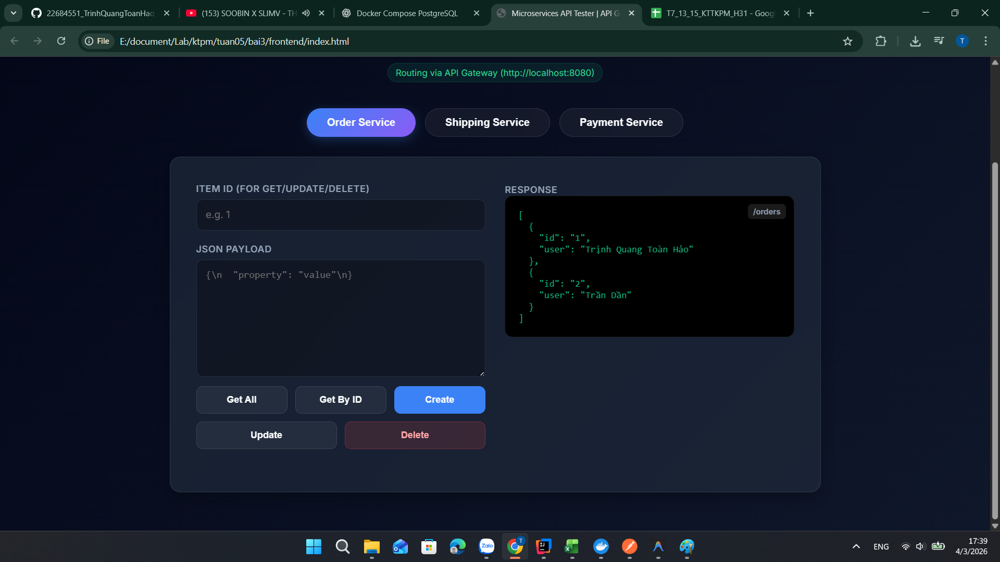 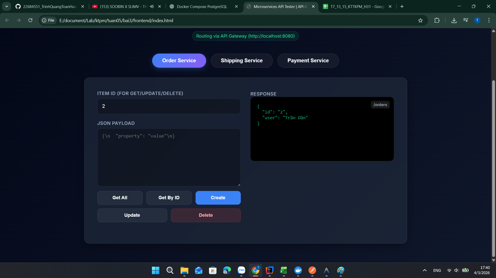 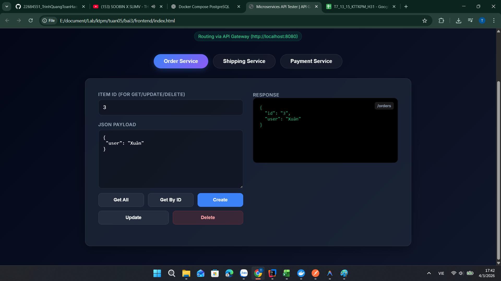 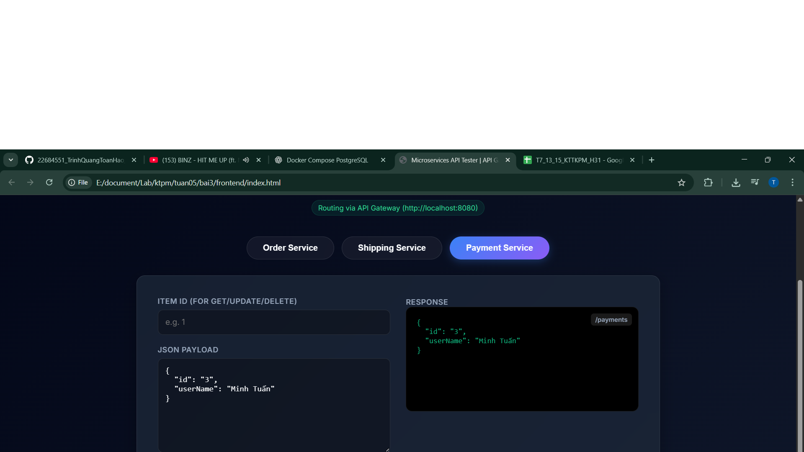 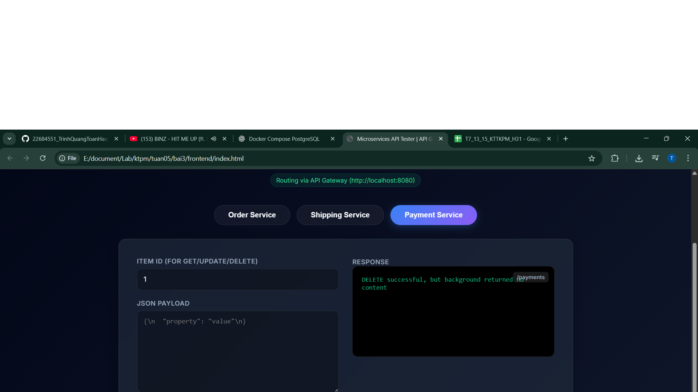 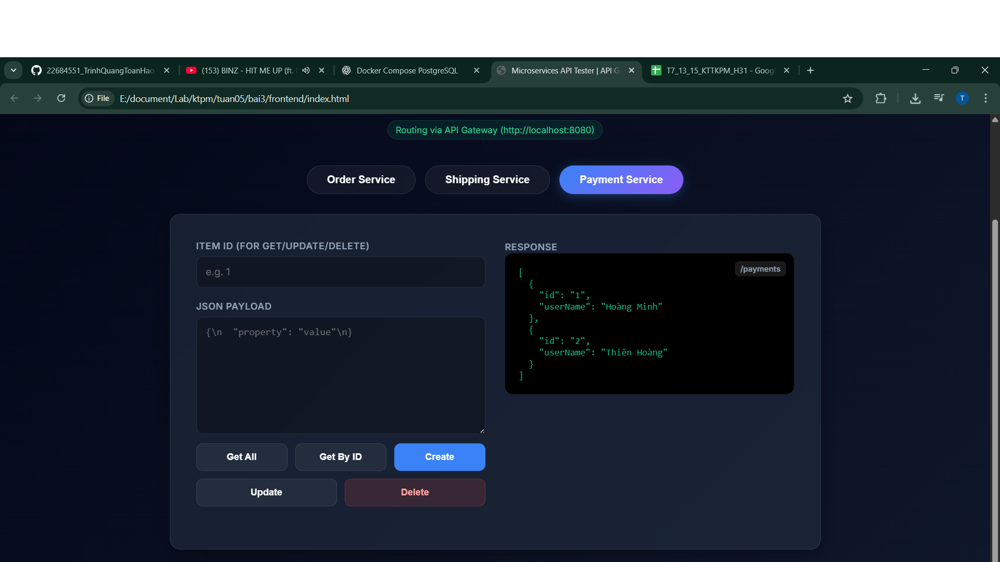 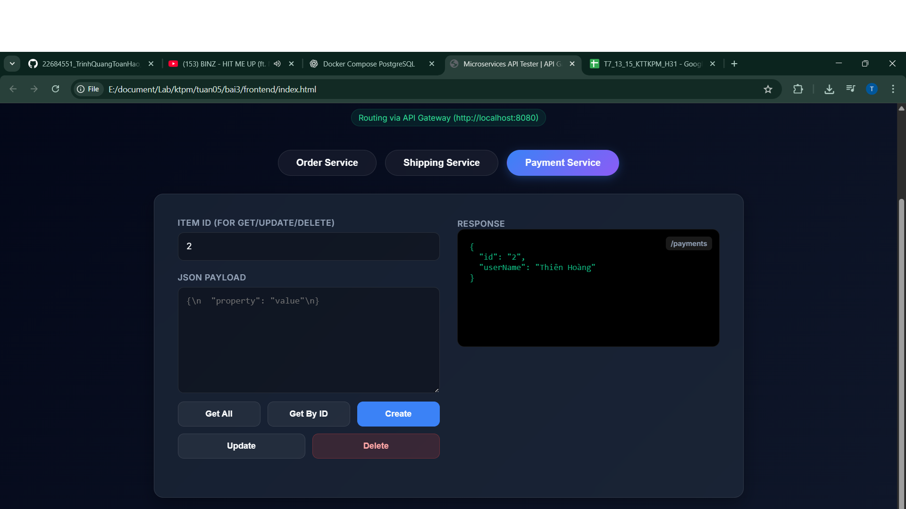 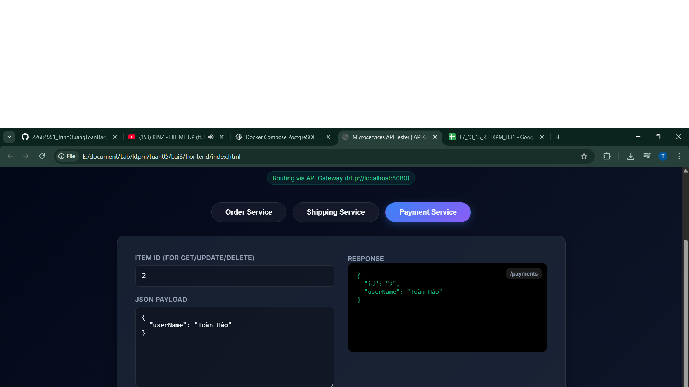  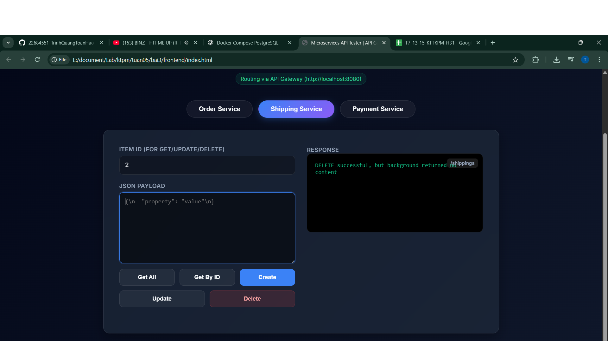   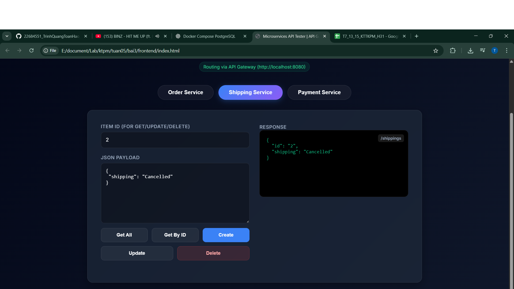

# Bài 4: Event Choreography vs Orchestration