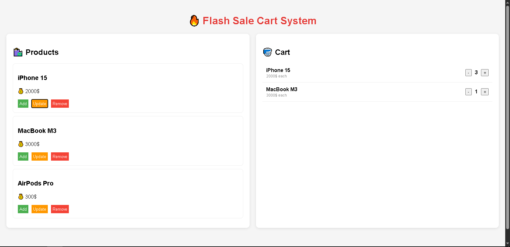
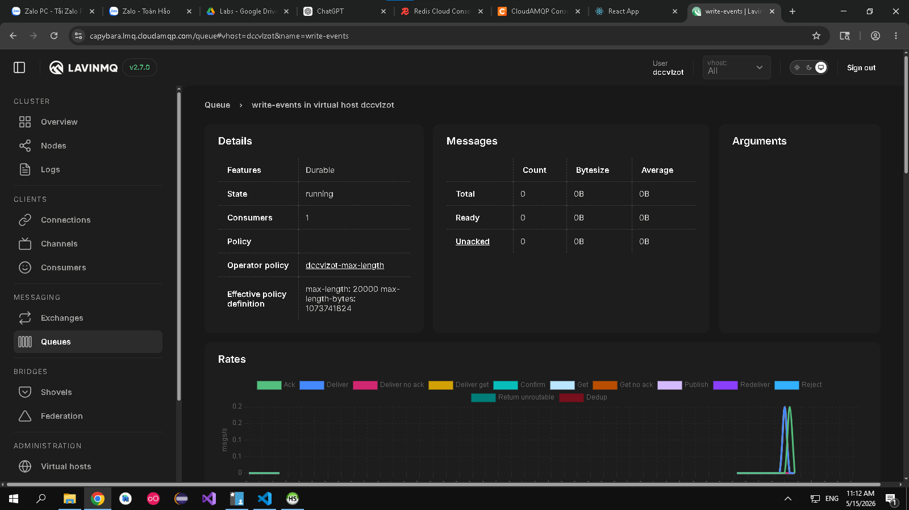
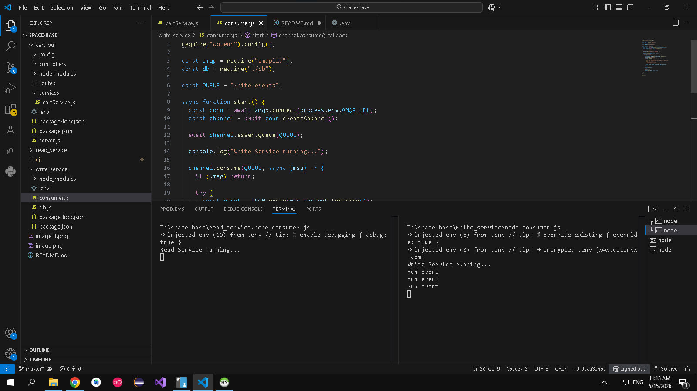
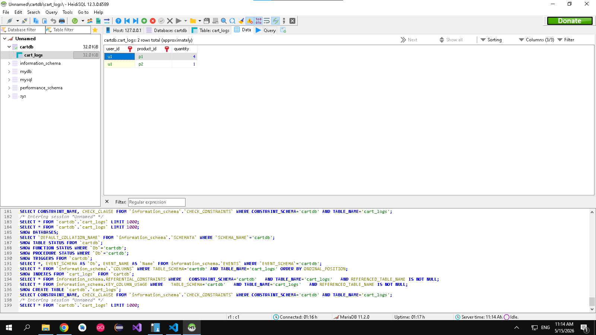

Giao diện

Khi nhấn vào thêm giỏ hàng thì data sẽ được thêm vào trong redis (vì dùng redis cloud nên không show hình db ra được) 
sau đó sẽ có 1 event được bắn vào message queue (sử dụng rabbitmq cloud) sau đó write_service sẽ nhận event và push vào trong DB

khi người dùng đọc dữ liệu, nếu dữ liệu không có thì sẽ xuống db đọc dữ liệu lên
sau đó 1 event sẽ được bắn lên queue, read_service sẽ nhận event rồi add dữ liệu vào trong redis